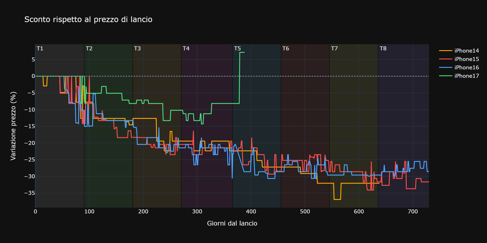
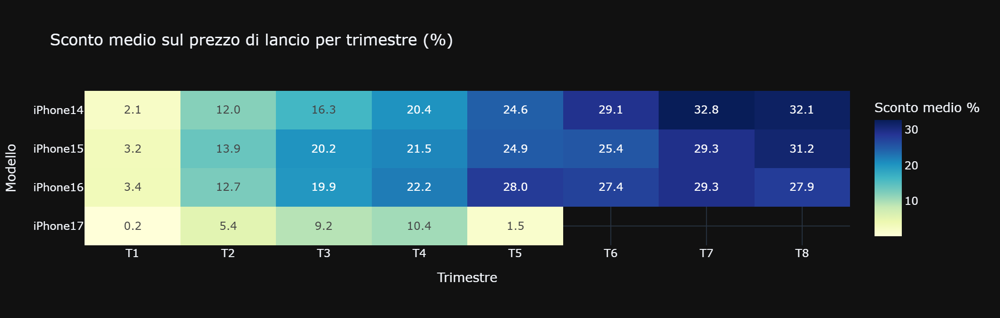
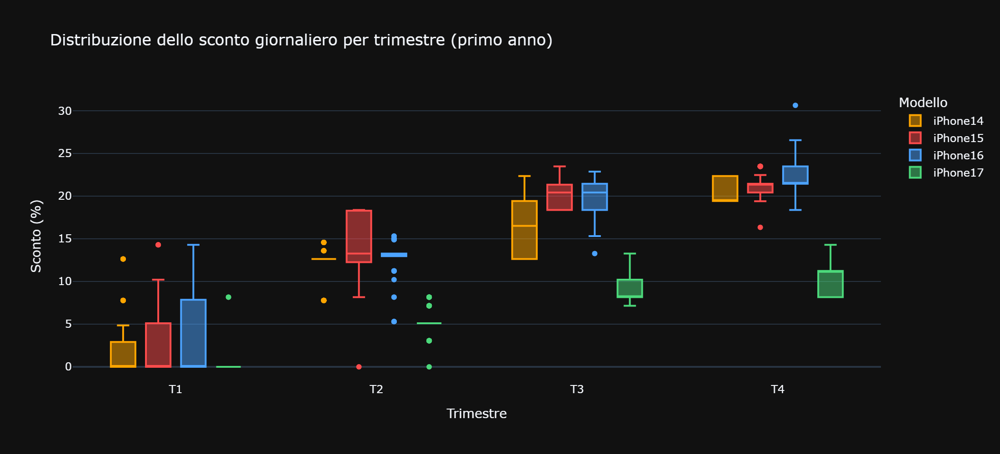
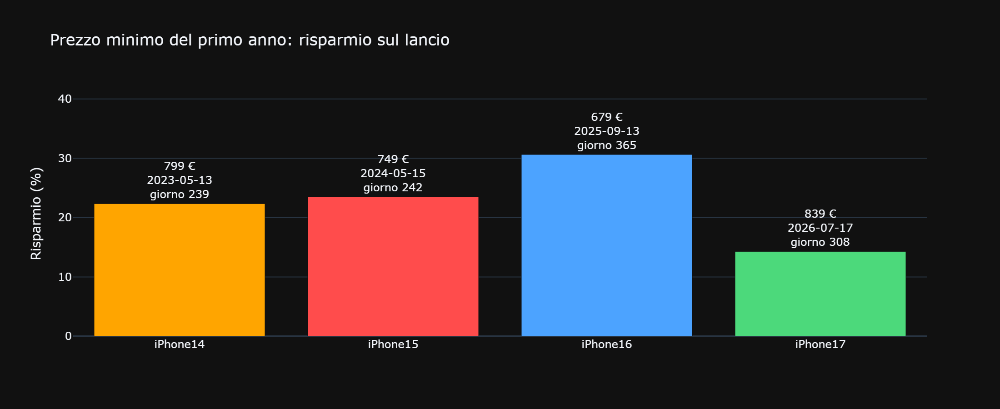
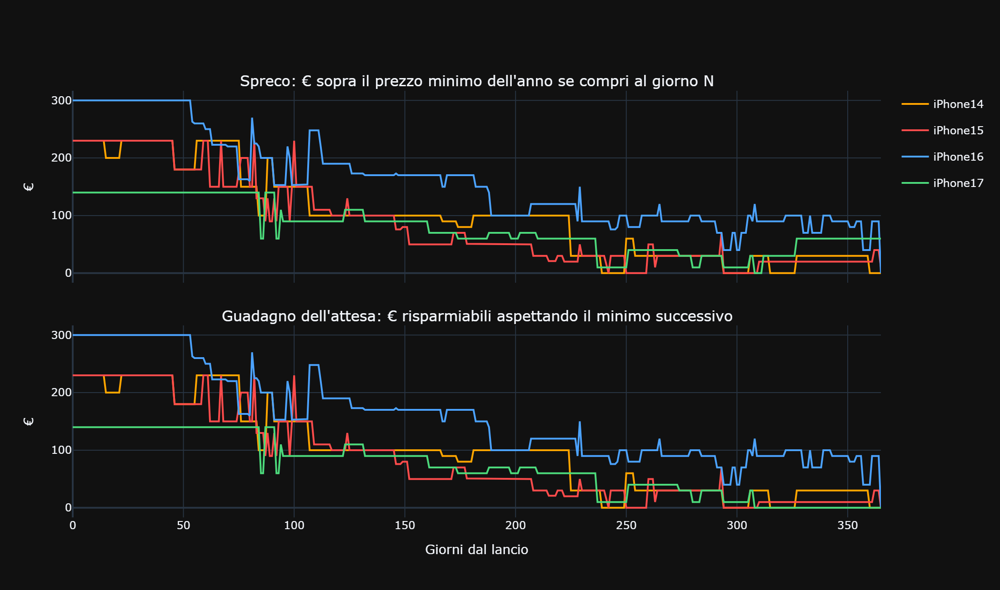
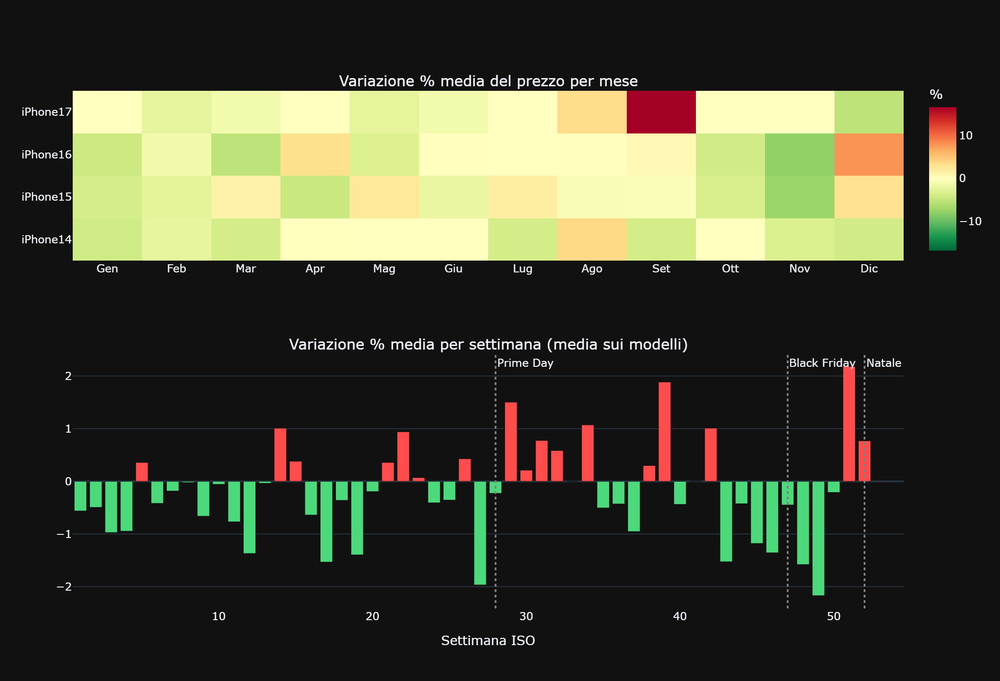
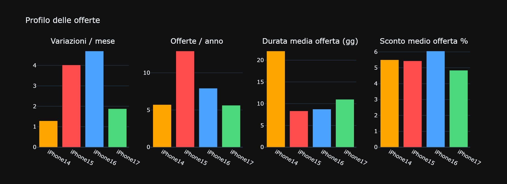
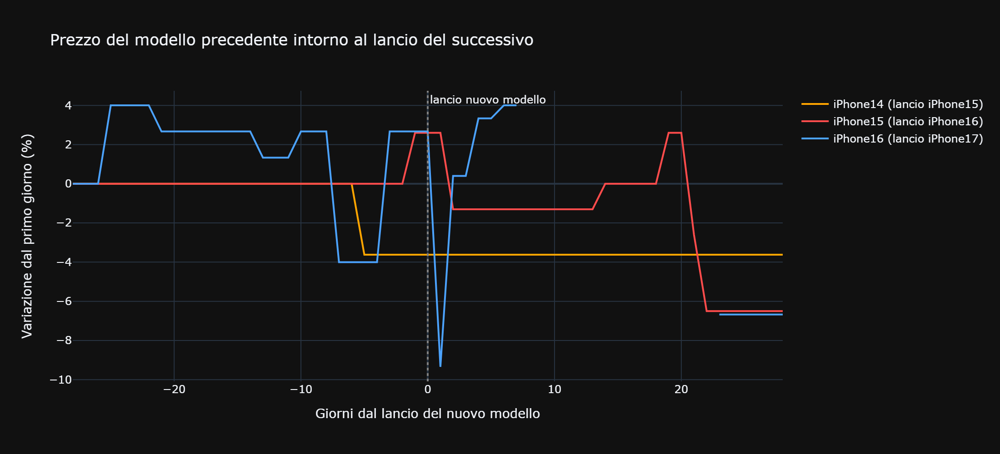

# Quando comprare un iPhone: analisi dei prezzi

Analisi dei prezzi Amazon di iPhone 14, 15, 16 e 17, allineati ai **giorni dal lancio** e misurati come **sconto rispetto al prezzo di lancio** (così 979 € e 1029 € si confrontano sulla stessa scala). Fonte: `Notebook/price_comparison.ipynb`, dati in `data/`.

## Conclusione

Il quadro che esce dai dati è abbastanza netto: **l'iPhone si compra tardi, non presto**. Il prezzo di lancio su Amazon è quasi sempre il punto più alto della vita del modello, e la discesa è graduale, non a scatti. Il fondo cade in media intorno a **8 mesi dal lancio** (giorno mediano del minimo: 275; per 14, 15 e 17 tra il giorno 239 e il 308). Chi compra lì risparmia in media il **22,7%** sul prezzo di lancio, circa 230 € su iPhone 14 e 15.

Il caso opposto è altrettanto chiaro: **i primi 30 giorni vanno evitati**. Per 15, 16 e 17 il prezzo non è mai sceso sotto quello di lancio in quel periodo; il 14 l'ha fatto solo nel 22% dei giorni, con uno sconto medio inferiore all'1%. Non c'è niente da guadagnare comprando subito, e c'è molto da perdere (da 140 a 300 €, vedi sezione 3).

Se non si può attendere otto mesi, due cose aiutano. La prima: il quarto trimestre di vita (giorni 271-365) è quello con lo sconto medio più alto per tutti e quattro i modelli, quindi è la zona in cui il rischio di "comprare troppo presto" è minimo. La seconda: la finestra del nuovo lancio a settembre **non è un affare garantito**. Il vecchio modello scende davvero solo circa quattro settimane dopo (-6,5% per iPhone 15, -6,7% per iPhone 16), quindi ottobre batte settembre.

Infine, dopo il minimo non conviene continuare ad aspettare: dal giorno 270 in poi il guadagno residuo dell'attesa scende sotto i 100 €, e il rischio di un rimbalzo (fine offerta, fine stock) pesa più del possibile risparmio.

## 1. Sconto nel tempo

La domanda di partenza è semplice: quanto costa un iPhone *rispetto a quando è uscito*, man mano che passa il tempo? Per rendere confrontabili modelli con prezzi di lancio diversi (979 € contro 1029 €) tutto è espresso come **sconto percentuale sul prezzo di lancio**, e le date sono sostituite dai **giorni dal lancio**: il giorno 100 dell'iPhone 14 si legge così accanto al giorno 100 del 16.

Ogni cella della tabella riporta **percentuale media del periodo / giorno migliore**, entrambe come sconto % rispetto al prezzo di lancio, calcolate sui primi 90, 180 e 365 giorni dal lancio:

- **Media del periodo**: sconto medio su tutti i giorni della finestra, cioè quanto risparmi in media comprando in un giorno qualsiasi.
- **Giorno migliore**: sconto del giorno con il prezzo più basso della finestra, cioè quanto risparmi azzeccando il momento giusto.

Le finestre sono cumulative (180 gg include i primi 90), perciò la media sale lentamente: i primi mesi, con sconto quasi nullo, la abbassano. Esempio: iPhone 15 a 365 gg, `14,8 / 23,5` = in media 14,8% sotto il lancio (circa 145 € su 979 €), 23,5% nel giorno migliore (749 €, -230 €).

| Modello | 90 gg | 180 gg | 365 gg |
|---|---|---|---|
| iPhone 14 | 2,1 / 12,6 | 7,0 / 14,6 | 12,8 / 22,4 |
| iPhone 15 | 3,2 / 14,3 | 8,5 / 18,4 | 14,8 / 23,5 |
| iPhone 16 | 3,4 / 14,3 | 8,0 / 15,3 | 14,6 / 30,6 |
| iPhone 17 | 0,2 / 8,2 | 2,8 / 8,2 | 6,4 / 14,3 |

% di giorni sotto il prezzo di lancio, entro 365 giorni: 14 → 84%, 15 → 86%, 16 → 85%, 17 → 75%.

Il 14, il 15 e il 16 si comportano in modo quasi sovrapponibile: sconto medio a un anno tra il 12,8% e il 14,8%, giorno migliore tra il 22% e il 31%. Il dato interessante è la distanza tra le due cifre di ogni cella: la media è bassa perché i primi mesi pesano a prezzo pieno, mentre il giorno migliore è molto più alto. **Il risparmio è concentrato in pochi momenti**, non distribuito in modo uniforme, e per prenderlo bisogna essere pronti quando capita.

**L'iPhone 17 è l'eccezione**: a 365 giorni lo sconto medio è del 6,4%, meno della metà degli altri, e il giorno migliore si ferma al 14,3%. Anche i giorni sotto il prezzo di lancio sono meno (75% contro 84-86%). Amazon ha scontato più timidamente questo modello, e a 90 giorni la media è praticamente zero (0,2%): per il 17 i primi tre mesi sono stati essenzialmente a prezzo pieno.

## 2. Il giorno migliore del primo anno

Qual è stato il prezzo più basso toccato nei primi 365 giorni, e quando? Il grafico riporta il minimo di ciascun modello, la tabella i dettagli.

| Modello | Lancio | Minimo | Data | Giorno | Risparmio |
|---|---|---|---|---|---|
| iPhone 14 | 1029 € | 799 € | 13/05/2023 | 239 | 230 € (22,4%) |
| iPhone 15 | 979 € | 749 € | 15/05/2024 | 242 | 230 € (23,5%) |
| iPhone 16 | 979 € | 679 € | 13/09/2025 | 365 | 300 € (30,6%) |
| iPhone 17 | 979 € | 839 € | 17/07/2026 | 308 | 140 € (14,3%) |

Tre cose si leggono nella tabella. **Primo**: il 14 e il 15 hanno toccato il fondo quasi alla stessa data dell'anno, a **metà maggio**, a circa 8 mesi dal lancio e con lo stesso risparmio (230 €). Due modelli diversi, a un anno di distanza, che fanno la stessa cosa non sembra un caso: è plausibile un effetto combinato di stock in esaurimento e promozioni di primavera.

**Secondo**: il minimo dell'iPhone 16 è un caso a parte. Cade al giorno 365, il 13 settembre 2025, cioè il giorno dopo il lancio dell'iPhone 17 (12/09/2025), e vale 300 € di sconto (30,6%). È l'unico dei quattro in cui l'arrivo del successore coincide con il fondo; ma resta *un solo caso*, e per 14 e 15 non è andata così (vedi sezione 6). Va letto come possibilità, non come regola.

**Terzo**: l'iPhone 17 ha toccato il minimo il 17 luglio 2026, a ridosso del Prime Day, ma con un risparmio di soli 140 € (14,3%), il più basso dei quattro. Per questo modello il fondo è arrivato presto e in modo moderato: non c'è stato un vero "crollo" da aspettare.

## 3. Costo dell'attesa

Sapere che il minimo esiste è utile, ma la domanda pratica è: *se non azzecco il giorno perfetto, quanto perdo?* Il grafico e la tabella misurano quanti euro si pagano **in più rispetto al minimo del primo anno** comprando al giorno N dal lancio.

| Modello | gg 0-30 | gg 90 | gg 180 | gg 270 | gg 365 |
|---|---|---|---|---|---|
| iPhone 14 | 230 € | 200 € | 80 € | 30 € | 0 € |
| iPhone 15 | 230 € | 90 € | 50 € | 30 € | 10 € |
| iPhone 16 | 300 € | 200 € | 170 € | 90 € | 0 € |
| iPhone 17 | 140 € | 140 € | 60 € | 40 € | 60 € |

Comprare nei primi 30 giorni costa **da 140 € (iPhone 17) a 300 € (iPhone 16) in più** del momento migliore, cioè il 14-31% del prezzo di lancio. Il costo scende con regolarità: a 180 giorni lo spreco è di 50-170 €, a 270 giorni di 30-90 €. La curva ha due velocità: il grosso del risparmio si recupera nei primi sei mesi, poi il miglioramento rallenta. L'iPhone 16 scende più lentamente (ancora 170 € a metà anno) perché il suo vero minimo è arrivato solo con il lancio del successore.

Nota sull'iPhone 17: a 365 giorni costa di nuovo 60 € sopra il minimo (erano 40 € a 270 giorni), perché dopo il minimo di luglio il prezzo è risalito. Dopo il fondo, il tempo non lavora più a favore di chi compra.

## 4. Stagionalità

Esiste un mese migliore per comprare, indipendentemente dall'età del modello? Qui si guarda la **variazione percentuale media del prezzo per mese e per settimana dell'anno**, mediata sui quattro modelli. Con soli quattro modelli e pochi anni di storia è un'indicazione, non una legge.

**Novembre** è il mese più favorevole: per 15 e 16 il prezzo cala in media del 7,2% e del 7,7%, coerente con il Black Friday. Il calo non dura: a **dicembre** il prezzo tende a risalire (+3,1% per il 15, +8,0% per il 16), segno che le offerte natalizie finiscono presto.

A livello di settimane, i cali più marcati sono la **49** (inizio dicembre, -2,2%), la **27** (luglio, Prime Day, -2,0%) e la **48** (Black Friday, -1,6%): sono le tre finestre in cui è statisticamente più probabile trovare un'offerta. Le settimane di rialzo sono la **51** (Natale, +2,2%) e la **39** (fine settembre, +1,9%); quest'ultima è il rimbalzo dopo il lancio del nuovo modello.

Un avvertimento: **settembre 2026 per l'iPhone 17 segna +16,7%**, un valore anomalo che può dipendere da scorte limitate o da venditori terzi più che da una dinamica di mercato. Va tenuto a mente leggendo la barra di settembre.

## 5. Offerte e volatilità

Oltre al trend lento, i prezzi hanno scatti brevi. Per misurarli si definisce **offerta** un periodo continuo in cui il prezzo è almeno il 3% sotto la mediana degli ultimi 60 giorni. Si contano quante ce ne sono ogni anno, quanto durano e quanto valgono, oltre a quante volte al mese il prezzo cambia (volatilità).

| Modello | Variazioni / mese | Offerte / anno | Durata media | Sconto medio offerta |
|---|---|---|---|---|
| iPhone 14 | 1,3 | 5,7 | 22 gg | 5,5% |
| iPhone 15 | 4,0 | 12,9 | 8 gg | 5,4% |
| iPhone 16 | 4,7 | 7,9 | 9 gg | 6,1% |
| iPhone 17 | 1,9 | 5,6 | 11 gg | 4,8% |

I quattro modelli hanno profili diversi. Il **15** è il più "nervoso" in termini di offerte: quasi 13 all'anno, ma di soli 8 giorni ciascuna. Il **16** cambia prezzo ancora più spesso (4,7 volte al mese) con meno offerte (7,9) e un po' più profonde (6,1%, la più alta). Per questi due modelli la lezione è pratica: le occasioni ci sono e sono frequenti, ma durano poco, quindi **conviene monitorare il prezzo e agire appena scende**, senza rimandare di qualche giorno.

Il **14** e il **17** funzionano all'opposto: pochi movimenti (1,3 e 1,9 variazioni al mese), offerte rare (circa 5-6 all'anno) ma più lunghe, 22 giorni per il 14 e 11 per il 17. C'è più tempo per decidere, ma meno occasioni tra cui scegliere. In tutti i casi lo sconto medio di una singola offerta è modesto (4,8-6,1%): le offerte non sostituiscono l'attesa del minimo, che vale dal 14 al 31%.

## 6. Effetto del lancio del nuovo modello

Dicono tutti "aspetta che esca il nuovo, il vecchio scende". È vero? Qui si guarda il prezzo del **modello precedente** nei giorni attorno al lancio del successivo (14 attorno al lancio del 15, 15 attorno al 16, 16 attorno al 17), come variazione rispetto a 28 giorni prima.

| Giorni dal lancio nuovo | iPhone 14 | iPhone 15 | iPhone 16 |
|---|---|---|---|
| -28 | 0% | 0% | 0% |
| 0 | -3,6% | +2,6% | +2,7% |
| +7 | -3,6% | -1,3% | +4,0% |
| +28 | -3,6% | -6,5% | -6,7% |

La risposta è: sì, ma con ritardo. **Il giorno del lancio il prezzo non crolla**: per 15 e 16 è addirittura più alto di quello di quattro settimane prima (+2,6% e +2,7%), e a una settimana il 16 sale ancora (+4,0%). Una spiegazione plausibile è che chi trova il nuovo modello troppo caro o non disponibile si rivolga al precedente, sostenendone il prezzo. Solo a **28 giorni** dal lancio il vecchio modello è davvero sotto: -6,5% per il 15 e -6,7% per il 16.

Il 14 è un caso a sé: il -3,6% è già presente al giorno 0 e non cambia più, quindi il calo è avvenuto *prima* del lancio del 15 e non ne dipende. Conclusione operativa: se si punta al modello uscito l'anno prima, **meglio ottobre che settembre**.

## 7. Situazione attuale (5 ottobre 2026)

Applicando quanto visto, ecco come leggere i prezzi di oggi.

**iPhone 17: aspettare.** Costa 1049 €, il **7,2% *sopra* il prezzo di lancio** (979 €) e 210 € sopra il minimo storico di 839 € (17/07/2026). Siamo a circa un anno dal lancio, il momento in cui il risparmio atteso è già maturato per gli altri modelli, ma il 17 ha avuto saldi più timidi e un rimbalzo a settembre. Lo storico suggerisce di attendere un calo: le finestre più probabili sono novembre (Black Friday) e le settimane 48-49.

**iPhone 16: buon momento.** Costa 699 €, a soli 20 € dal suo minimo storico (679 €). Con più di un anno di vita ha già ceduto quasi tutto lo sconto disponibile: per chi vuole un modello recente a un prezzo vicino al fondo è una scelta ragionevole, e attendere ancora offre poco da guadagnare.

**iPhone 15: già sotto il minimo del primo anno.** L'ultimo dato è 599 € (10/09/2026), 150 € sotto il minimo del primo anno (749 €): è una fase di fine ciclo, con sconti più profondi di quelli del primo anno. Se il 15 basta, è il più conveniente dei tre; il dato però non è recente, quindi conviene verificare il prezzo corrente.
